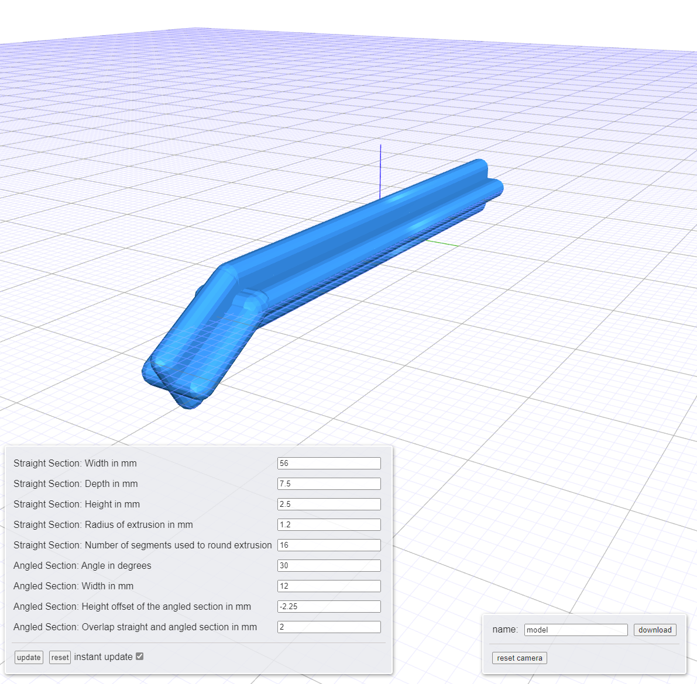

# rummikub-leg

This project contains JSCAD code in `index.js` to generate a replacement leg for my [Rummikub](https://en.wikipedia.org/wiki/Rummikub) board game set.

## Usage

There are different 'flavors' of JSCAD that you can use based on your needs
- web: online (no install) simply go to [https://jscad.app/](https://jscad.app/)
- web: self hosted, cli, desktop app: see [https://github.com/jscad/OpenJSCAD.org](https://github.com/jscad/OpenJSCAD.org)
- node.js: custom mix and match of packages
  * all the packages are available [on NPM](https://www.npmjs.com/search?q=%40jscad) under the '@jscad' name

## License

[MIT License](./LICENSE)
